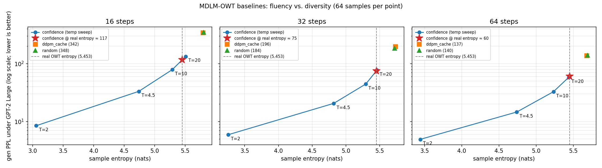
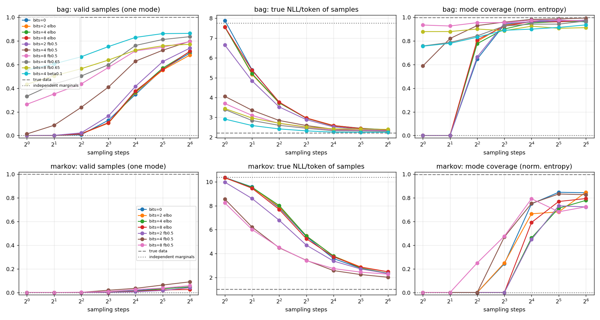

# CALGD: Context-Aware Latent-Gated Diffusion

**Does a sampled discrete latent, or an information-gain revealer, improve few-step sampling in
masked diffusion language models?**

This is a research fork of [MDLM](https://github.com/kuleshov-group/mdlm) (Sahoo et al.,
NeurIPS 2024). All credit for the base framework, models and checkpoints goes to the original
authors; see [Based on MDLM](#based-on-mdlm) and [Citation](#citation).

> **Status:** baselines reproduced; the revealer is a documented **negative** result; the latent
> bits give a large, replicated gain on synthetic data. Next: the latent at real scale, as a
> fine-tune of the MDLM checkpoint. See [Roadmap](#roadmap).

## Motivation

Masked diffusion LMs generate by unmasking many tokens in parallel. Tokens unmasked in the same
step are sampled independently given the current context, which is the main source of quality
loss when sampling with few steps. This project tests two ways of reducing that loss:

1. **Latent bits.** A short vector of discrete bits `z` is sampled once per sequence and
   conditions the denoiser, so tokens decoded in the same step share `z` and can be correlated
   instead of independent. Training uses an encoder `q(z | x0)`, a uniform prior `p(z)` for
   sampling, and a KL term. The KL must be down-weighted during training (weight ≈ 0.1): under
   the exact bound the latent collapses (see the probe below). Reported bounds use the full KL.
2. **Information-gain revealer.** A small head scores masked positions by how much revealing them
   would reduce the loss on the rest of the sequence, and the sampler unmasks the highest-scoring
   positions first. It is trained on counterfactual reveals with a pairwise ranking loss.

The claim being tested is about **sample quality at a fixed small number of steps**, at matched
compute and matched diversity; neither idea is expected to improve likelihood much.

## Evaluation protocol

- **Primary:** generative perplexity under GPT-2 Large **and** per-sample token entropy, at
  16/32/64 sampling steps. Lower generative perplexity can come from repetitive text, so samplers
  are compared at matched entropy; real OpenWebText has 5.45 ± 0.16 nats.
- **Sampler baselines:** MDLM's `ddpm_cache`; fixed-count unmasking in random order; and
  confidence order with MaskGIT-style annealed noise, swept over temperature to trace a curve.
- **Secondary:** validation perplexity bound (OpenWebText, WikiText-2, PTB).
- **Noise:** single-run perplexity varies by about ±4% on WikiText-2, and generative perplexity
  from 64 samples by about ±10%, so comparisons use several seeds or confidence intervals.

## Roadmap

- [x] **Reproduce the baseline** on the released MDLM checkpoint.
- [x] **Evaluation pipeline:** `mode=sample_sweep`, sample entropy, ordered samplers, float64
      sampling.
- [x] **Baseline sweeps** for MDLM, random and confidence ordering.
- [x] **Revealer on the frozen MDLM checkpoint** (negative; see results).
- [x] **Synthetic probes** for the latent (positive, 3 seeds; see results).
- [ ] **Latent fine-tune of MDLM** (encoder + latent conditioning, KL weight 0.1) with a matched
      no-latent fine-tune as control.
- [ ] **Latent from scratch** at ~125M parameters on OpenWebText, if the fine-tune is positive.

## Results

### Baseline reproduction

Released checkpoint `kuleshov-group/mdlm-no_flashattn-fp32-owt`, evaluated on a Colab T4:

| Metric | Value | Notes |
|---|---|---|
| WikiText-2 val PPL | 35.2 (range 33.4–36.4) | 3 seeds; paper reports ≤32.83 |
| PTB val PPL | ~108 | 1 seed; paper reports ≤95.26 |

The paper's zero-shot numbers come from a longer-trained model, which likely explains most of the
gap. All comparisons in this project are against these measured baselines.

### Sampler baselines (64 samples per point)

Gen-PPL under GPT-2 Large; real OpenWebText entropy is 5.45 ± 0.16 nats.

| Steps | `ddpm_cache` | Random order | Confidence @ entropy 5.45 |
|---|---|---|---|
| 16 | 342 | 348 | ≈117 |
| 32 | 196 | 184 | ≈75 |
| 64 | 137 | 140 | ≈60 |

- **Ordering matters a lot:** at real-text entropy, confidence ordering lowers generative
  perplexity 2.3–3× versus random order, and at 16 steps it beats random order at 64.
- **Pure confidence ordering collapses** into repeated filler tokens (entropy 0.3–1.4); annealed
  noise fixes this, and the temperature trades fluency for diversity (T≈20 reaches real-text
  entropy).
- **Random order and MDLM's sampler are equivalent:** only which positions are revealed matters,
  not whether the count per step is fixed.



### Revealer: negative result

A reveal head on the frozen MDLM checkpoint, trained on counterfactual labels: for 8 masked
candidates per sequence, reveal the candidate with a value sampled from the model (4 independent
samples) and measure the drop in mean loss on the remaining masked tokens. Pairwise ranking loss;
the head learns a correction on top of confidence. 2,581 labeled sequences (2,063 train / 518 val).

- **Labels are dominated by whether the sampled value is right.** Two halves of the samples agree
  on 73% of candidate pairs (within-sequence r = 0.42; ≈0.59 for the 4-sample average).
- **Ranking:** head 0.600 vs. confidence 0.592 pairwise accuracy (+0.009, 95% CI +0.002 to +0.016).
  On sample-averaged gains, head 0.633 vs. 0.627 for Σp² (mean sampled-token probability).
- **Sampling:** at matched temperature the revealer is indistinguishable from confidence ordering
  (gen-PPL within ~2% at 16/32/64 steps, T=10 and T=20; diamonds in the figure above).

Interpretation: measured against the true text, "most informative reveal" collapses to "most likely
correct", which confidence already captures. At the noise level needed for real-text diversity
(T≈20), early unmasking is close to random for any scorer, so a scorer would need to be far better
than confidence to matter. Cost: about 3 L4-hours.

### Latent-bits probe (synthetic data)

Sequences of 32 tokens generated by one of 16 hidden modes; a sample is valid if all its tokens
come from a single mode. Small masked diffusion transformers trained from scratch, with and
without 4 latent bits (encoder in training, uniform prior at sampling). 3 seeds; each seed also
draws a different set of modes.

| Valid samples (mean of 3 seeds) | 1 step | 4 steps | 16 steps | 64 steps |
|---|---|---|---|---|
| No latent | 0.00 | 0.01 | 0.35 | 0.70 |
| 4 bits, KL weight 0.1 | 0.69 | 0.76 | 0.87 | 0.89 |

- **Trained on the exact likelihood bound, the latent collapses** (KL → 0.01–0.03 nats) and
  gives no benefit. With a perfect denoiser a masked diffusion model's bound is already tight,
  so a latent's KL cost cancels its gain; its value is only in few-step sampling, which the
  per-token training loss never measures.
- **With KL weight 0.1 (or free bits ≈ 0.65 nats/bit) the code is used and sharp,** and
  few-step validity improves dramatically, while the bound (evaluated with the full KL) is
  slightly better than without the latent in every seed. Mode coverage stays near uniform, and
  samples' true likelihood stays above the data's own, so the gain is not bought with diversity.
- **Code sharpness matters more than size.** A noisy code (free bits 0.5) barely helps at one
  step; 8 bits for 16 modes wastes most of the prior on codes the encoder never uses.
- **On Markov-structured data,** the latent removes mode-mixing errors (one-step local validity
  0.22 → 0.44) but cannot replace steps for within-mode dependencies.



Script: `probes/latent_probe.py`; per-run figures and metrics in `docs/probe/`.

## Changes from upstream MDLM

- **Optional heavy dependencies.** `flash-attn`, `mamba-ssm` and `causal-conv1d` imports are
  optional, so evaluation runs on GPUs without flash-attention (e.g. a T4).
- **`mode=sample_sweep`.** Generates samples at several step counts and records generative
  perplexity, entropy, seconds per sample and the samples themselves to `sample_sweep.json`.
- **`sampling.predictor=ordered`.** Fixed-count unmasking with `sampling.order=` `random`,
  `confidence` (with `sampling.confidence_temp`, MaskGIT-style annealed noise) or `revealer`
  (with `sampling.revealer_path` and `sampling.revealer_temp`).
- **`sampling.fp64` (default `True`).** Float64 categorical sampling, avoiding float32 truncation
  that understates generative perplexity. Set `False` to reproduce stock MDLM sampling.
- **Revealer pipeline** (`revealer.py`): `mode=revealer_label` (counterfactual information-gain
  labels, resumable) and `mode=revealer_train` (head training with confidence baselines,
  reliability and bootstrap confidence intervals).
- **Latent probe** (`probes/latent_probe.py`): standalone synthetic experiment.
- **GPT-2 Large is loaded once** for generative perplexity instead of on every batch.

## Quickstart

On Colab, follow **[docs/colab.md](docs/colab.md)** for setup (Python 3.13 and flash-attention
workarounds) and for the revealer and probe commands. For example:

```bash
# Zero-shot perplexity
python main.py mode=ppl_eval backbone=hf_dit eval.checkpoint_path=/content/mdlm-nofa \
  data=wikitext2 model.length=1024 loader.batch_size=8 loader.eval_batch_size=8 \
  trainer.precision=32 eval.generate_samples=False wandb=null

# Sample sweep with confidence-ordered unmasking
python main.py mode=sample_sweep backbone=hf_dit eval.checkpoint_path=/content/mdlm-nofa \
  eval.disable_ema=True data=openwebtext-split model.length=1024 \
  sampling.predictor=ordered sampling.order=confidence sampling.confidence_temp=20 \
  loader.eval_batch_size=8 sampling.num_sample_batches=8 wandb=null

# Latent probe
python probes/latent_probe.py --out probe_out --bits 0 4 --beta 0.1 --tag beta0.1
```

On a GPU with flash-attention (Ampere or newer), `eval.checkpoint_path=kuleshov-group/mdlm-owt`
also works; drop `trainer.precision=32`.

## Repository layout

| Path | Contents |
|---|---|
| `main.py` | Entry point: training, `ppl_eval`, `sample_eval`, `sample_sweep`, `revealer_label`, `revealer_train` |
| `diffusion.py` | Forward/reverse diffusion, samplers (incl. `ordered`), generative perplexity |
| `revealer.py` | Revealer head, information-gain labels, ranking loss, metrics |
| `probes/latent_probe.py` | Synthetic latent-bits probe |
| `noise_schedule.py` | Noise schedules |
| `dataloader.py` | Datasets and dataloaders |
| `models/` | Denoisers: DiT, AR transformer, Mamba |
| `configs/` | Hydra configs (data, models, noise, sampling, revealer) |
| `scripts/` | Upstream Slurm scripts |
| `docs/` | Colab guide, figures, probe results |

## Based on MDLM

This repository is a fork of [kuleshov-group/mdlm](https://github.com/kuleshov-group/mdlm), which
introduced MDLM, a masked diffusion LM with a substitution-based parameterization that reduces the
absorbing-state diffusion loss to a mixture of masked-language-modeling losses. The upstream
authors note that an improved implementation is available in the
[DUO repo](https://github.com/s-sahoo/duo), and MDMs with KV caching in the
[Eso-LMs repo](https://github.com/s-sahoo/Eso-LMs).

<details>
<summary>Upstream usage reference</summary>

**Checkpoints.** MDLM trained on OpenWebText for 1M steps:
[kuleshov-group/mdlm-owt](https://huggingface.co/kuleshov-group/mdlm-owt) (flash-attention) and
[kuleshov-group/mdlm-no_flashattn-fp32-owt](https://huggingface.co/kuleshov-group/mdlm-no_flashattn-fp32-owt)
(regular attention, float32). AR and SEDD baseline checkpoints are in the upstream
[Google Drive folder](https://drive.google.com/drive/folders/16LuuptK7Xfk-vzhQYZBZ0SA-B-BFluau?usp=sharing).

**Environment (upstream).** `conda env create -f requirements.yaml && conda activate mdlm`.

**Samplers.** `sampling.predictor` takes `ddpm_cache` (MDLM's fast sampler), `ddpm` (D3PM
ancestral sampling), `analytic` (SEDD), and in this fork `ordered`. Semi-autoregressive generation
of longer sequences: `sampling.semi_ar=True sampling.stride_length=512 sampling.num_strides=2`.

**Generate samples:**
```bash
python main.py mode=sample_eval eval.checkpoint_path=kuleshov-group/mdlm-owt \
  data=openwebtext-split model.length=1024 sampling.predictor=ddpm_cache \
  sampling.steps=1000 loader.eval_batch_size=1 sampling.num_sample_batches=10 backbone=hf_dit
```

**Train MDLM from scratch on OpenWebText:**
```bash
python main.py model=small data=openwebtext-split wandb.name=mdlm-owt parameterization=subs \
  model.length=1024 eval.compute_generative_perplexity=True sampling.steps=1000
```
`loader.batch_size` and `loader.eval_batch_size` set the per-GPU batch sizes; Lightning uses
gradient accumulation to reach the global batch size. Slurm scripts are in `scripts/`.

**Perplexity of a local checkpoint:**
```bash
python main.py mode=ppl_eval loader.batch_size=16 loader.eval_batch_size=16 \
  data=openwebtext-split model=small parameterization=subs backbone=dit model.length=1024 \
  eval.checkpoint_path=/path/to/checkpoint/mdlm.ckpt +wandb.offline=true
```
For the AR baseline use `model=small-ar parameterization=ar backbone=ar`; for SEDD use
`parameterization=sedd time_conditioning=True sampling.predictor=analytic`.

</details>

## Citation

If you use this code, please cite MDLM:

```bibtex
@inproceedings{
sahoo2024simple,
title={Simple and Effective Masked Diffusion Language Models},
author={Subham Sekhar Sahoo and Marianne Arriola and Aaron Gokaslan and Edgar Mariano Marroquin and Alexander M Rush and Yair Schiff and Justin T Chiu and Volodymyr Kuleshov},
booktitle={The Thirty-eighth Annual Conference on Neural Information Processing Systems},
year={2024},
url={https://openreview.net/forum?id=L4uaAR4ArM}
}
```

## Acknowledgements and license

Built on [MDLM](https://github.com/kuleshov-group/mdlm), which itself builds on
[SEDD](https://github.com/louaaron/Score-Entropy-Discrete-Diffusion). Licensed under Apache-2.0,
as is the upstream project; see `LICENSE`.
